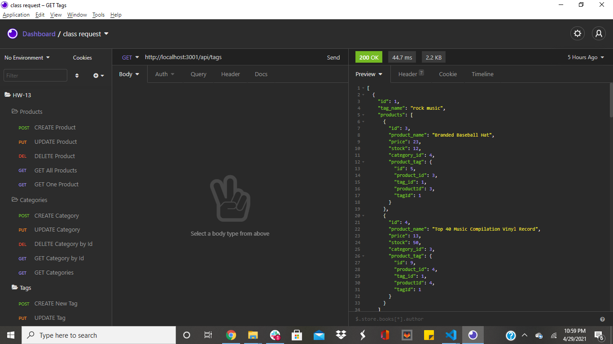
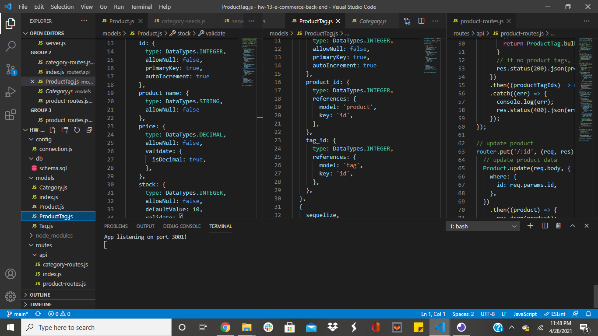

# ORM: E-Commerce Back End

## Description
Internet retail, or e-commerce, is the largest sector of the electronics industry. This application creates a back end for an e-commerce website, using Express.js API, MySQL database, and then tested in Insomnia Core. 
- Adding the database name, MySQL username, and MySQL password to an environment variable file enables a connection to the database using Sequelize. 
- Then a schema and seed commands are entered creating a development database seeded with test data. 
- After a command is entered to invoke the application, the server is started and the Sequelize models are synced to the MySQL database.
- API GET routes can be opened in Insomnia Core for categories, products, or tags and the data for each of these routes is displayed in a formatted JSON.
- When the API POST, PUT, and DELETE routes are tested in Insomnia Core, data in the database can be successfully created, updated, and deleted.

## License
This project is licensed under the MIT license. Click the link below for more info.

[MIT License](https://opensource.org/licenses/MIT)

## Usage
Click the link below to see a video of how the application works.

[E-Commerce Back End](url.com)

